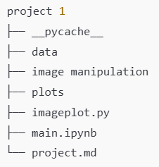
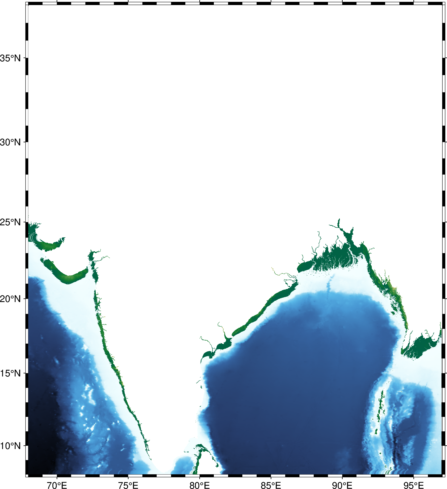
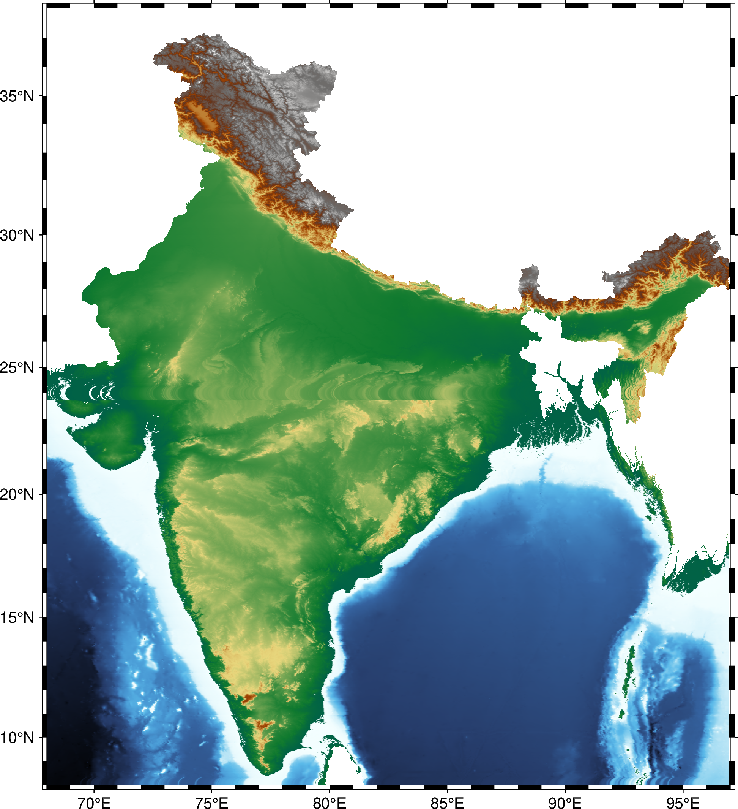

<h1 style="text-align: center;">Project 1</h1>

### Folder Structure must be follows:

<!--  -->

    

Data folder is not available on GitHub. You need to download it.
<a href="https://drive.google.com/drive/folders/185s6GPg_lCsxFv08o4BXslnWhguH9wIt?usp=drive_link">Click</a>

<h3 style = "background-color :black; border-radius:10px; color :white; padding:5px;" >Plot Full Map of India Using `.xyz` or `.txt` File</h3>
This project involves plotting the map of India using topographic data provided in a `.txt` or `.xyz` file. The data is first converted to a CSV format and then visualized using PyGMT

> **Data Conversion**: Convert the text data to CSV format for easier manipulation. 
> **Full Map Plotting**: Plot the entire map of India using the CSV data. 

    

<!-- --------------------------------------------------------- -->
<h3 style = "background-color :black; border-radius:10px; color :white; padding:5px;" >Plot Land Portions of India</h3>

This project involves plotting the land portions of India using topographic data provided in a `.txt` or `.xyz` file.and clip usnig `boundary.geojson` file:

> **Cropping Land Portion**: Use a GeoJSON file to crop and focus on India's land portion.
<!-- 2. **Water Portion Plotting**: Plot the water portion separately. -->
<!-- 3. **Shapefile Integration**: Integrate shapefiles to enhance the map with additional geographical features. -->
<!-- 4. **Merging Plots**: Merge the land and water plots together. (Note: Nepal, China, Bhutan, and Bangladesh are not included in the plot.) -->

    

<!-- -------------------------------------------------------------- -->
<h3 style = "background-color :black; border-radius:10px; color :white; padding:5px;" >Plot water Portions of India</h3>

This project involves plotting the land portions of India using topographic data provided in a `.csv` file.and clip usnig `World_Seas_IHO_v3.shp` file:

> **Plot shp file**: Plot the shapefile of water portion of India. 
> **Cropping water Portion**: Use a `.shp` file to crop and focus on India's water portion. 
> **Water Portion Plotting**: Plot the water portion separately.
<!-- 3. **Shapefile Integration**: Integrate shapefiles to enhance the map with additional geographical features. -->
<!-- 4. **Merging Plots**: Merge the land and water plots together. (Note: Nepal, China, Bhutan, and Bangladesh are not included in the plot.) -->

    
    

<!-- ---------------------------------------------------------------------------------------------------------------------- -->
<h3 style = "background-color :black; border-radius:10px; color :white; padding:5px;" >Merge the land and water portion of India</h3>

Simply using `pillow` module we do it.(this is a shortcut process otherwise you can use geojson file to crop it)

> **Transparent image**: Firstly we make transparent the `croped image of india water.png` and `croped image of india land.png`. 
>**Merge them**: Using `pillow` module we merge them . 
>**plot** : using `pygmt` finally we plot the merged image 

    

<!DOCTYPE html>
<html lang="en">
<head>
  <meta charset="UTF-8">
  <meta name="viewport" content="width=device-width, initial-scale=1.0">
  <title>Thank You</title>
  
</head>
<body>
  

    <h1>Thank You Sir</h1>
  

</body>
</html>

---

